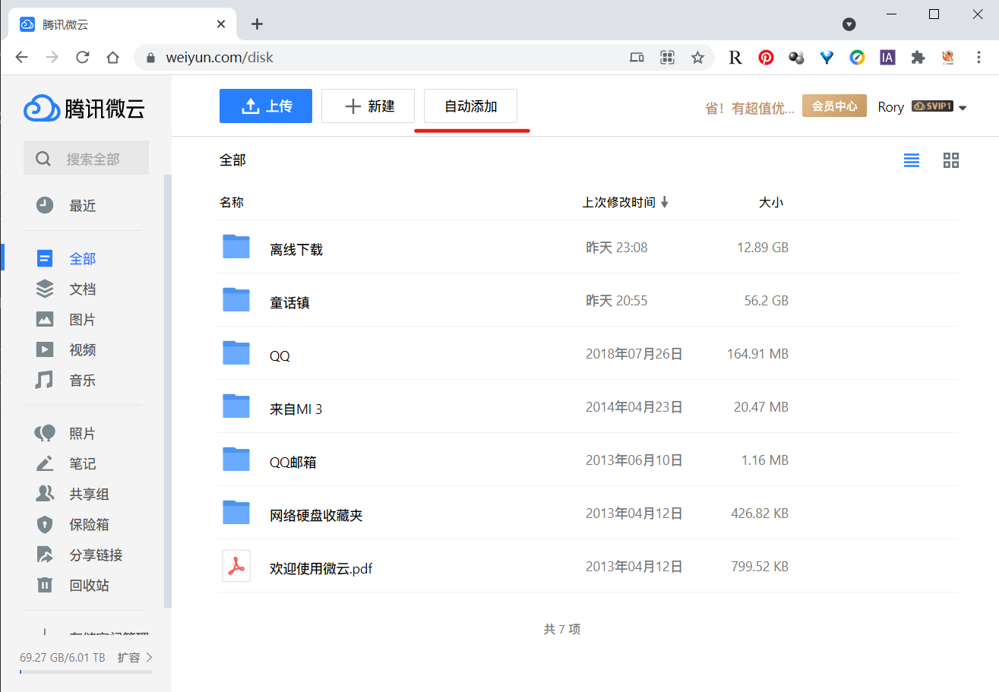
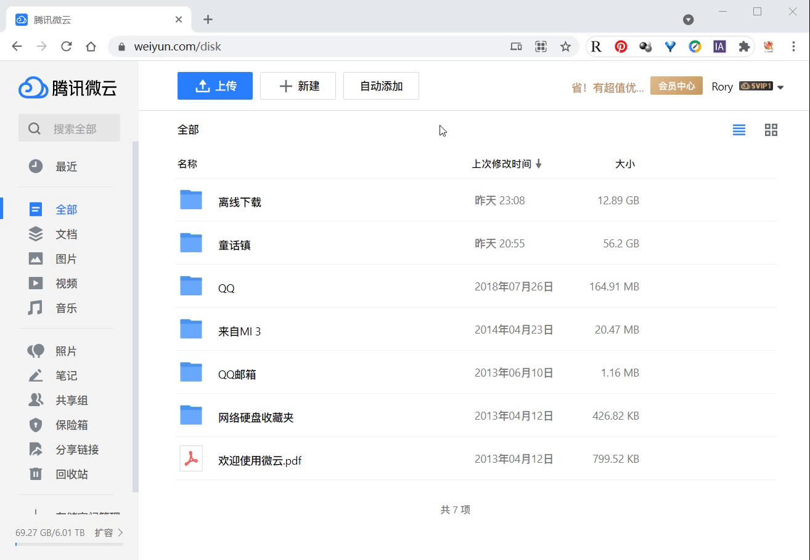

# weiyun-auto-add

## :pencil: 关于
如果你也为微云不能批量粘贴离线下载链接而烦恼，本插件可以帮你解决一半的问题，自动粘贴剪贴板中的内容到微云的离线下载。
具体表现在，将原本添加链接的 **五步**：点击新建 -> 点击离线下载 -> 点击链接下载 -> 填入链接 -> 点击下一步，变为 **一步**：点击自动添加。当然，前提是你已经复制了链接。

## :pushpin: 安装
通过 OpenUserJS 安装脚本: **[点我](https://openuserjs.org/scripts/jortana/Weiyun_Auto_Add_Task_%E5%BE%AE%E4%BA%91%E8%87%AA%E5%8A%A8%E5%A1%AB%E5%86%99%E7%A6%BB%E7%BA%BF%E4%B8%8B%E8%BD%BD%E9%93%BE%E6%8E%A5)**  
然后点击页面右上角的 `Install` 进行安装

## :open_book: 使用
在完成安装之后，当你登录到微云的时候，也就是你的地址栏显示类似 `https://www.weiyun.com/disk*` 这种形式的时候，界面上会多一个 **自动添加** 的按钮，如下图所示：

点击 **自动添加** 按钮，脚本会帮你将你的 **剪贴板** 中的内容添加到离线下载的列表中

配合一些分享链接的站点，可以实现非常快速的多个链接的添加，比如配合[人人视频分享站](https://yyets.dmesg.app/home)

## :rocket: 贡献
欢迎对本项目提交 Issues 帮助我完善脚本  
如果你对 JS 有所了解，可以直接提交 **Pull Requests**